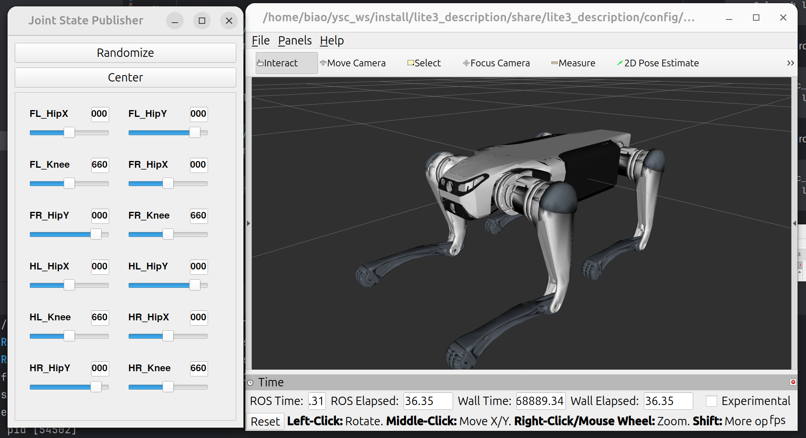
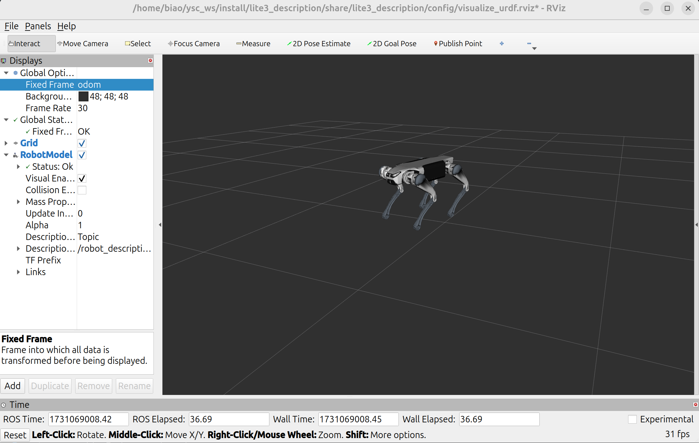
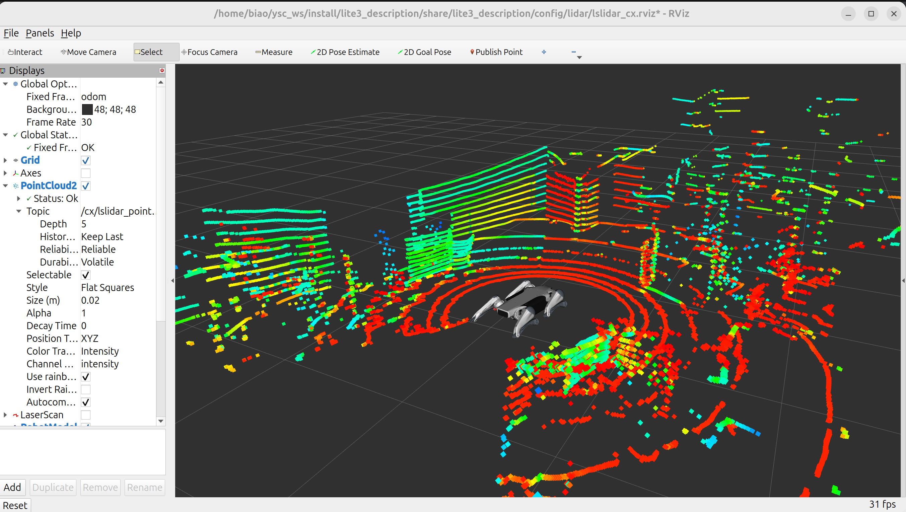
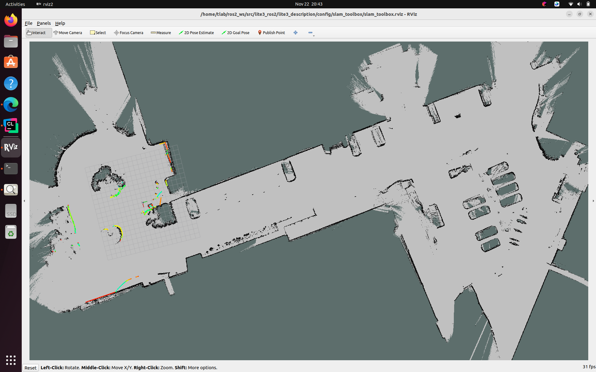
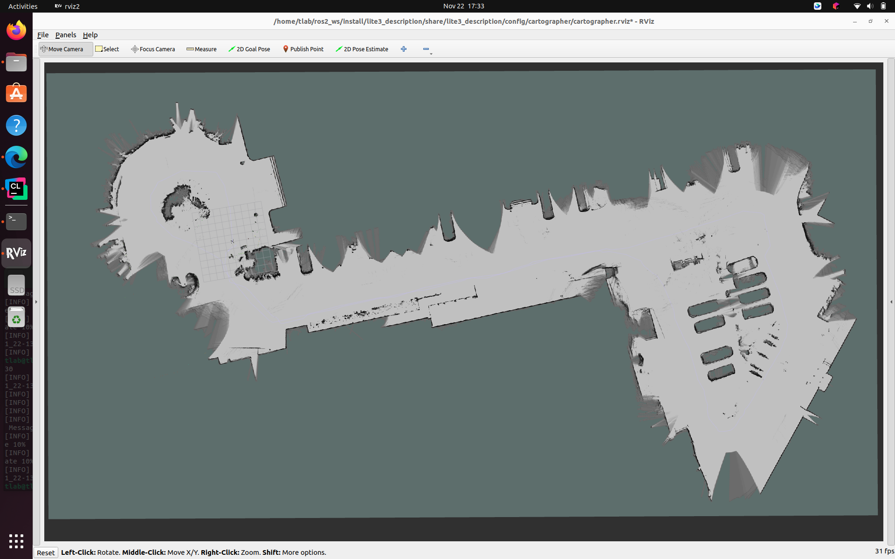
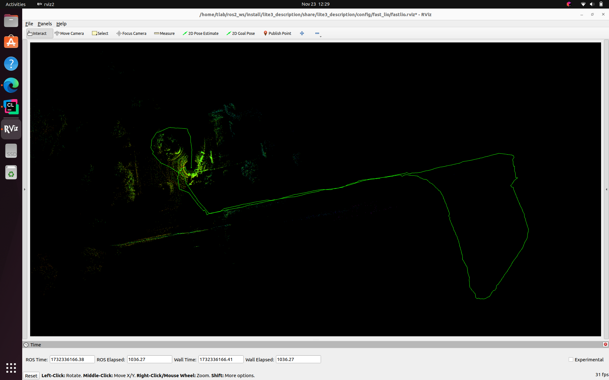
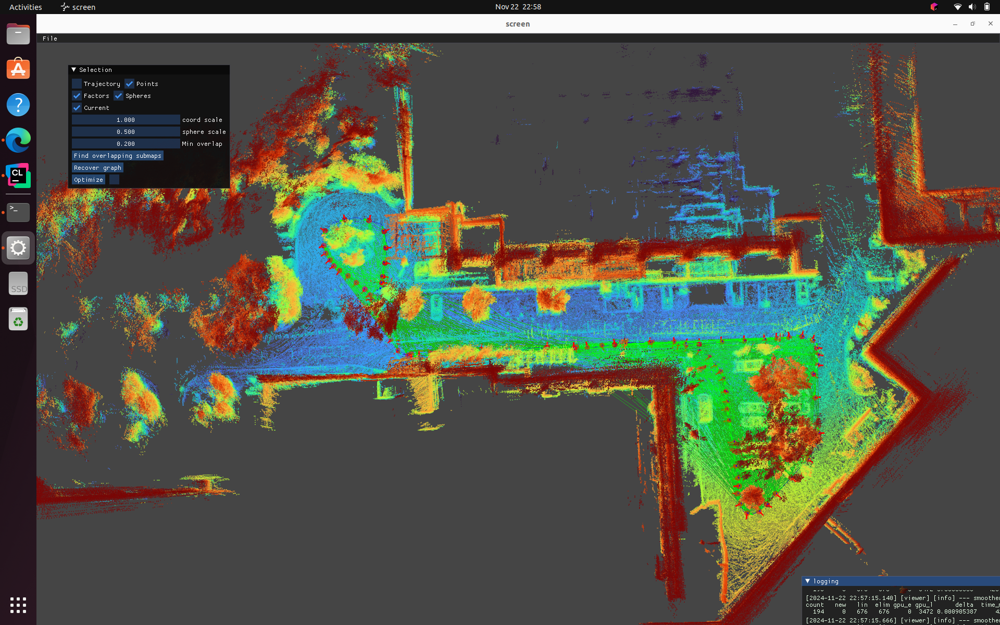

# Lite3 ROS2

This repository is an unofficial project for DeepRobotics Lite3.

## 1. Quick Start

* prepare workspace

```bash
cd ~
mkdir ros2_ws
cd ros2_ws
mkdir src
cd src
```

* Clone the repository

```bash
git clone https://github.com/legubiao/Lite3_ROS2
cd lite3_ros2
git submodule update --init --recursive
```

* rosdep

```bash
cd ~/ros2_ws/
rosdep install --from-paths src --ignore-src -r -y
```

* compile packages

```bash
cd ~/ros2_ws/
colcon build --packages-up-to lite3_udp_bridge lite3_description --symlink-install
```

* launch

```bash
source ~/ros2_ws/install/setup.bash
ros2 launch lite3_description bridge.launch.py
```

### 1.1 Visualize Robot

* To visualize and check the configuration of the robot in rviz, simply launch:

  ```bash
  source ~/ros2_ws/install/setup.bash
  ros2 launch lite3_description visualize.launch.py check_gui:=true
  ```



* To visualize the robot with the actual joint states data, launch:
  ```bash
  source ~/ysc_ws/install/setup.bash
  ros2 launch lite3_description visualize.launch.py
  ```



### 1.2 LsLidar Visualization

* Install dependency
  ```bash
  sudo apt-get install libpcap-dev
  ```
* Compile lidar driver
  ```bash
  cd ~/ros2_ws/
  colcon build --packages-up-to lslidar_driver --symlink-install
  ```
* To visualize the robot with lidar data, launch:
  ```bash
  source ~/ros2_ws//install/setup.bash
  ros2 launch lite3_description lslidar.launch.py
  ```



## 2. SLAM

* record ros2 bag
  ```bash
  ros2 bag record /cx/scan /cx/lslidar_point_cloud /imu/data /leg_odom /tf /tf_static /joint_states /robot_description
  ```

### 2.1 SLAM Toolbox

* Install
  ```bash
  sudo apt-get install ros-jazzy-slam-toolbox
  ```
* Launch
  ```bash
  source ~/ros2_ws/install/setup.bash
  ros2 launch lite3_description slam_toolbox.launch.py :use_sim_time:=true
  ```



### 2.2 Cartographer 2D

* Install
  ```bash
  sudo apt-get install ros-jazzy-cartographer-ros
  ```
* Launch
  ```bash
  source ~/ros2_ws/install/setup.bash
  ros2 launch lite3_description slam_cartographer.launch.py :use_sim_time:=true
  ```



### 2.3 Fast-LIO

* Install
    * ROS2 Verion of FAST_LIO could be found [here](https://github.com/Ericsii/FAST_LIO_ROS2)
* Launch
  ```bash
  source ~/ros2_ws/install/setup.bash
  ros2 launch lite3_description slam_fast_lio.launch.py :use_sim_time:=true
  ```



### 2.4 GLIM

* Install
    * Following the instruction [here](https://koide3.github.io/glim/)
    * The required config file could be found at `lite3_description/config/glim`
      

